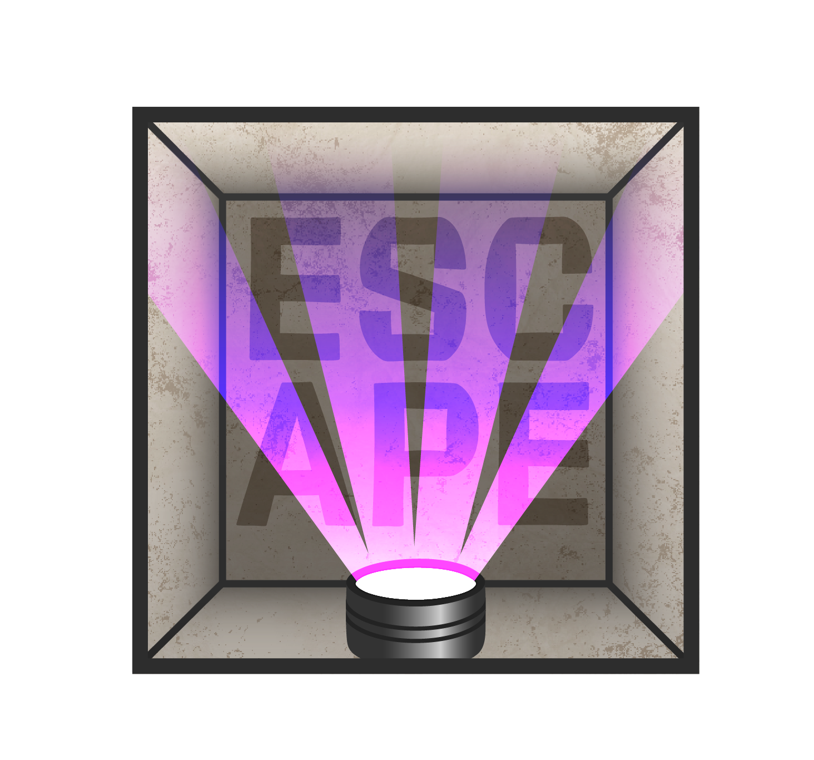

# 🎮 **Escape**  
**A psychological thriller developed with Unreal Engine 5**

## 📜 **Project Description**  
**Escape** is a first-person thriller game developed in **Unreal Engine 5**, blending exploration, tension, and puzzles.  
You wake up in a dark, unfamiliar room. The air is heavy, and the silence, oppressive. Something’s wrong — and the only thing at your side is a flickering flashlight.

Your goal?  
**Escape.**  
But nothing is that simple...

Inspired by real-life **escape rooms**, **Escape** offers an immersive and unsettling experience where every detail matters. You'll need to solve disturbing puzzles, piece together fragmented memories through photographs, and uncover the reason behind your captivity — all before it's too late. Don’t take your time...

## 🧩 **Main Features**

1. **Immersive First-Person Exploration**  
   - Discover your surroundings from a **first-person perspective**, brought to life with highly realistic visuals using **Unreal Engine 5**.  
   - Equipped only with a **flashlight**, explore a dark, oppressive room that hides more than it reveals.

2. **Puzzle-Based Progression**  
   - Solve a series of **escape room-style puzzles** to uncover hidden clues.  
   - Each puzzle you solve reveals a piece of your **story**, bringing you closer to **freedom**. 

3. **Time Pressure Mechanic**  
   - You have a **limited amount of time** to escape — though you're never explicitly told how much.  
   - Once time runs out, **escape is no longer an option**...

4. **Atmosphere Above All**   
   - The tension builds with every second as mystery and fear close in.

## 🚀 **Installation and Setup**

⚠️ **Escape is still under development and not yet available for download.** ⚠️

## 🛠️ **Technologies Used**  
- **Engine**: Unreal Engine 5  
- **Languages**: Blueprint / C++ (Unreal)

## 🎯 **Future Improvements**  
- Add multiple endings based on the photos discovered  
- Implement voice-over narration for found memories  
- Expand the game to include multiple escape rooms

## 🧑‍💻 **Authors**  
Developed as part of a creative learning project at **Ynov Lyon**.  
   - Ethan Romano — 3D Artist & Project Manager  
   - Evan Jacquier — 3D Artist  
   - Joemy Musichini — 3D Artist  
   - Ryan Amarat — 3D Artist  
   - Ornella Capezzone — Creative Design  
   - [Hugo Flandrin](https://github.com/HugoFlandrin) — Developer  
   - [Sebastien Chevallier](https://github.com/SebastienChevallier) — Developer  
   - [Orion Maillot](https://github.com/OrianMA) — Developer  

### ⛓️ **Can You Escape?**