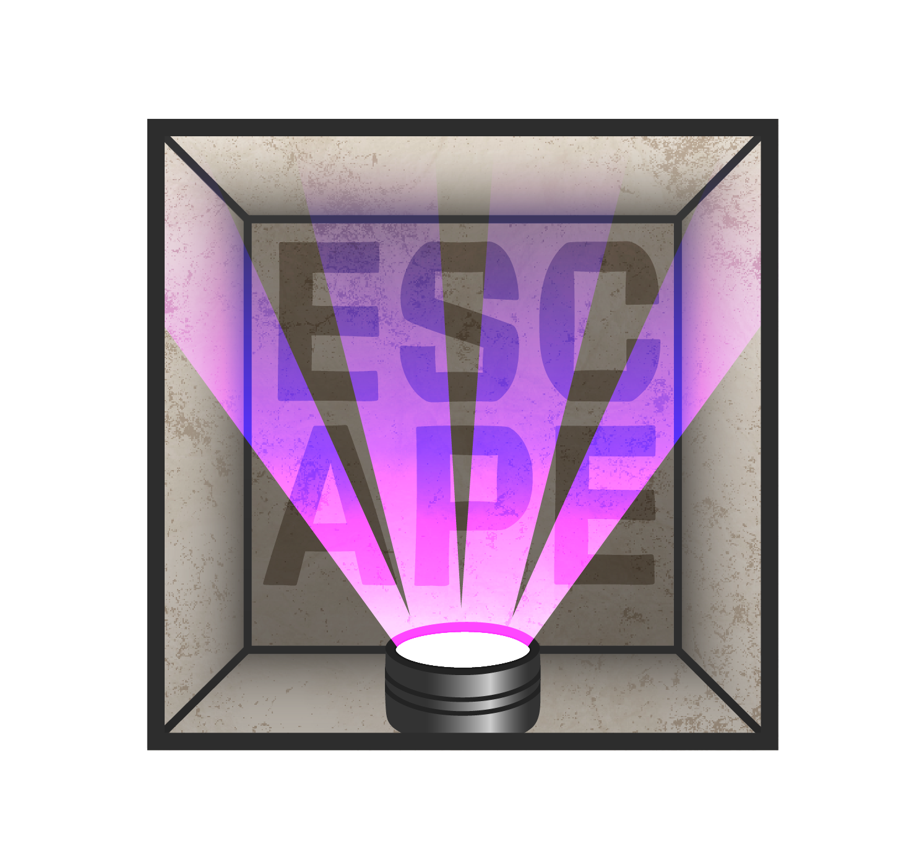

# 🎮 **Escape**  
**Un thriller psychologique développé avec Unreal Engine 5**

## 📜 **Description du projet**  
**Escape** est un thriller à la première personne développé avec **Unreal Engine 5**, mêlant exploration, tension et énigmes.  
Vous vous réveillez dans une pièce sombre et inconnue. L'air est lourd, et le silence, oppressant. Quelque chose ne va pas — et la seule chose à vos côtés est une lampe torche vacillante.

Votre objectif ?  
**S'échapper.**  
Mais rien n'est aussi simple...

Inspiré des **escape games** réels, **Escape** propose une expérience immersive et angoissante où chaque détail compte. Vous devrez résoudre des énigmes troublantes, reconstituer des souvenirs fragmentés à travers des photographies, et découvrir la raison de votre captivité — avant qu'il ne soit trop tard. Ne perdez pas de temps...

## 🧩 **Fonctionnalités principales**

1. **Exploration immersive à la première personne**  
   - Découvrez votre environnement à la **première personne**, porté par des visuels très réalistes grâce à **Unreal Engine 5**.  
   - Équipé seulement d'une **lampe torche**, explorez une pièce sombre et oppressante qui cache plus qu'elle ne révèle.

2. **Progression basée sur les énigmes**  
   - Résolvez une série d'**énigmes façon escape game** pour découvrir des indices cachés.  
   - Chaque énigme résolue révèle une partie de votre **histoire**, vous rapprochant de la **liberté**.

3. **Mécanique de pression temporelle**  
   - Vous disposez d'un **temps limité** pour vous échapper — bien qu'on ne vous dise jamais explicitement combien.  
   - Une fois le temps écoulé, **s'échapper n'est plus une option**...

4. **L'atmosphère avant tout**   
   - La tension monte à chaque seconde, entre mystère et peur grandissante.

## 🚀 **Installation et mise en route**

📦 Une version jouable est disponible sur [itch.io](https://hugoflandrin.itch.io/escape). Il suffit de télécharger et lancer le fichier `.exe` pour jouer !

## 🛠️ **Technologies utilisées**  
- **Moteur** : Unreal Engine 5  
- **Langages** : Blueprint / C++ (Unreal)

## 🎯 **Améliorations futures**  
- Ajouter plusieurs fins selon les photos découvertes  
- Mettre en place une narration en voix off pour les souvenirs retrouvés  
- Étendre le jeu à plusieurs escape rooms

## 🧑‍💻 **Auteurs**  
Développé dans le cadre d'un projet pédagogique créatif à **Ynov Lyon**.  
   - Ethan Romano — Artiste 3D & Chef de projet  
   - Evan Jacquier — Artiste 3D  
   - Joemy Musichini — Artiste 3D  
   - Ryan Amarat — Artiste 3D  
   - Ornella Capezzone — Direction créative  
   - [Hugo Flandrin](https://github.com/HugoFlandrin) — Développeur  
   - [Sebastien Chevallier](https://github.com/SebastienChevallier) — Développeur  
   - [Orion Maillot](https://github.com/OrianMA) — Développeur  

### ⛓️ **Parviendrez-vous à vous échapper ?**
